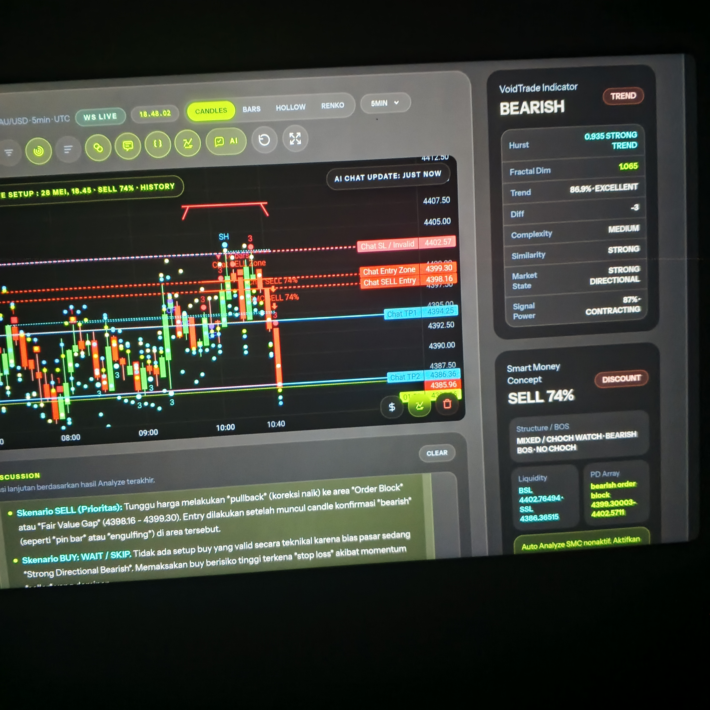
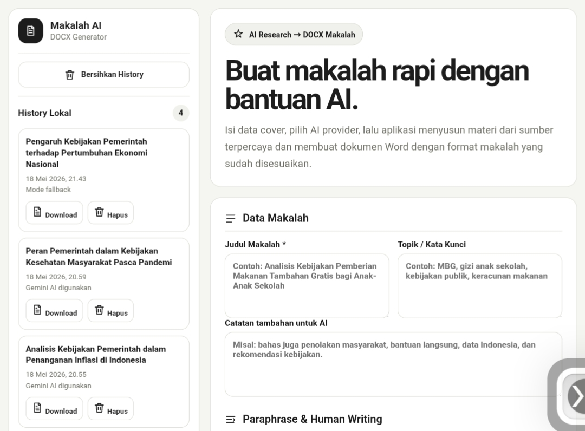
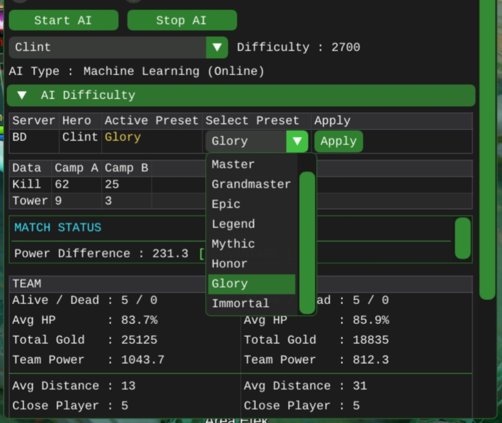

<!-- TYPING -->
<div align="center">
  <a href="https://git.io/typing-svg">
    
  </a>
</div>

<br/>

<div align="center">
  
  &nbsp;
  <a href="https://github.com/DevZhii?tab=followers">
    
  </a>
  &nbsp;
  
  &nbsp;
  <a href="https://master-builder-delta.vercel.app/">
    
  </a>
</div>

<br/>

---

## 🧑‍💻 About Me

```typescript
const DevZhii = {
  title:     "Builder 🔨",
  target:    "The Master Builder — 2030 🎯",
  role:      "Full Stack & Mobile Developer",
  portfolio: "https://master-builder-delta.vercel.app/",
  github:    "https://github.com/DevZhii",
  email:     "zhiitian81@gmail.com",

  experience: { years: 5, projects: 20, users: "1k+" },

  expertise: [
    "Full Stack Web Development",
    "Mobile Development (Flutter, React Native)",
    "Reverse Engineering 🔍",
    "System Architecture & Design",
  ],

  currentlyBuilding: "Scalable digital products 🏗️",
  philosophy: "Reliable. Scalable. Built to endure.",
};
```

<br/>

---

## 🛠️ Tech Stack

### 🎨 Frontend
<div>
  
  
  
  
  
  
  
  
  
  
</div>

### ⚙️ Backend
<div>
  
  
  
  
  
  
  
  
</div>

### 📱 Mobile
<div>
  
  
  
  
  
  
  
</div>

### 🗄️ Database & Cloud
<div>
  
  
  
  
  
  
  
  
  
  
  
</div>

### 🔍 Reverse Engineering
<div>
  
  
  
  
  
  
  
</div>

<br/>

---

## 📊 GitHub Stats

<div align="center">
  
</div>

<br/>

---

## 🚀 Featured Projects

<div align="center">

<table width="100%" cellpadding="0" cellspacing="12" border="0">
  <tr>
    <td width="50%" align="center">
      <a href="https://github.com/DevZhii/VoidTrade">
        
      </a>
      <br/><br/>
      <a href="https://github.com/DevZhii/VoidTrade">
        
      </a>
      <br/>
      <sub>Laravel · Livewire · Tailwind · AI API · WebSocket · SQLite</sub>
    </td>
    <td width="50%" align="center">
      <a href="https://github.com/DevZhii/MakalahWeb">
        
      </a>
      <br/><br/>
      <a href="https://github.com/DevZhii/MakalahWeb">
        
      </a>
      <br/>
      <sub>Python · Gemini AI · Vanilla JS · CSS3 · python-docx</sub>
    </td>
  </tr>
  <tr>
    <td colspan="2" align="center">
      <br/>
      <a href="https://github.com/DevZhii/SystemPanel">
        
      </a>
      <br/><br/>
      <a href="https://github.com/DevZhii/SystemPanel">
        
      </a>
      <br/>
      <sub>C++ · IDA Pro · Frida · Imgui · Assembly · Android Studio · MT Manager</sub>
    </td>
  </tr>
</table>

</div>

<br/>

---

## 📈 Contribution Graph

<div align="center">
  
</div>

<br/>

---

## 🌐 Connect With Me

<div align="center">
  <a href="https://master-builder-delta.vercel.app/">
    
  </a>
  &nbsp;
  <a href="https://github.com/DevZhii">
    
  </a>
  &nbsp;
  <a href="mailto:zhiitian81@gmail.com">
    
  </a>
  &nbsp;
  <a href="https://t.me/elelqezhi">
    
  </a>
</div>

<br/>

---

<!-- FOOTER -->
<div align="center">
  
</div>

<div align="center">
  <i>"I transform vision into reality — architecting digital products that are reliable, scalable, and built to endure."</i>
  <br/><br/>
  <strong style="color:#00d9ff">DevZhii · Builder 🔨 → The Master Builder 2030 🎯</strong>
</div>
